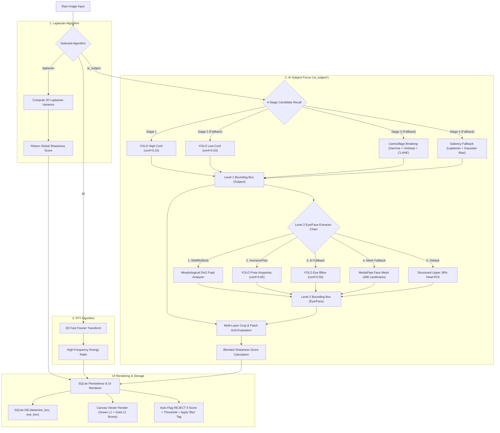

# Scan for Blur (Blur Detection, 2-Level YOLO & Tagging Pipeline)

This skill documents all 3 algorithms for detecting out-of-focus or blurry photos during photographic culling sessions, auto-flagging them as `REJECT`, applying the `"Blur"` tag, and rendering 2-level bounding boxes (Level 1: Subject, Level 2: Eye/Face).



---

## 🔬 3 Blur Detection Algorithms

Photographers can select their preferred algorithm from a 2-column sidebar modal (`BlurScanDialog`):

### 1. Variance of Laplacian (`"laplacian"`) - Default / Ultra-Fast
Measures the variance of the 2D Laplacian operator across the luminance channel:
$$\text{Sharpness Score} = \text{Var}(\nabla^2 I)$$
- **Speed**: ⭐⭐⭐⭐⭐ (< 3ms / image)
- **Detects**: General defocus blur and soft edges.
- **Best For**: Rapid first-pass culling, general photography, landscape, studio.
- **Implementation**: [culler/detectors/blur/laplacian.py](file:///d:/Projects/image-culler/culler/detectors/blur/laplacian.py)

---

### 2. AI Subject Focus (`"ai_subject"`) - 2-Level YOLO + 4-Stage Recall + Multi-Layer Crop
Unified intelligent algorithm combining YOLOv8 AI detection, multi-stage candidate recall, Level 2 Head/Eye zone extraction, and saliency fallback.
- **Implementation**: [culler/detectors/blur/yolo_subject.py](file:///d:/Projects/image-culler/culler/detectors/blur/yolo_subject.py), [culler/detectors/blur/eye_detector.py](file:///d:/Projects/image-culler/culler/detectors/blur/eye_detector.py)

- **4-Stage Candidate Recall Architecture**:
  1. **Stage 1 (High-Confidence Pass, `conf=0.15`)**: Runs YOLOv8 (`yolov8n.pt`) with candidate box selection algorithm (`select_best_subject_box`). Prioritizes portrait/wildlife classes (`person`, `bird`, `dog`, `cat`, `animals`) and applies a 15% edge margin penalty for non-subject corner clutter. Requires minimum `score=0.02` to prevent full-frame background selection.
  2. **Stage 2 (Low-Confidence Pass, `conf=0.03`)**: Runs low-threshold YOLO pass.
  3. **Stage 3 (Multi-Layer Camouflage Breaking — `detect_camouflaged_subject`)**: If YOLO yields no candidates, subjects are exposed using aggressive preprocessing:
     - **Gamma Correction**: Reveals subjects hiding in deep shadow/highlights.
     - **Unsharp Masking**: Breaks structural camouflage by amplifying high-frequency micro-contrast.
     - **LAB CLAHE**: Enhances local luminance contrast.
  4. **Stage 4 (Contrast-Saliency Fallback — `extract_saliency_subject_box`)**: If still no candidates, uses local Laplacian variance map with strong Gaussian Center Bias to frame the highest focus-density cluster.

- **Level 2 Eye / Face Extractor (`extract_eye_face_box` & `extract_eye_box_mediapipe`)**:
  1. **Morphological DoG Eye Analyzer (`detect_bird_eye_morphological`)**: Runs first for wildlife. Mimics retinal ganglion cells using Difference of Gaussians (DoG) to locate dark pupil-like blobs regardless of lighting. Uses extremely relaxed contour constraints to handle camouflage, scoring candidates by DoG strength, circularity, and positional prior.
  2. **YOLO Pose Keypoints (`detect_eye_yolo_pose`, `conf=0.65`)**: Fallback for humans/pets. High threshold prevents hallucinating eyes on bird shoulders.
  3. **YOLO Eye Bounding Box (`detect_eye_yolo_bbox`, `conf=0.50`)**: Last resort AI box fallback.
  4. **MediaPipe Face Mesh (`extract_eye_box_mediapipe`)**: 468 landmark mesh for tight human eye contour extraction when MediaPipe is available.
  5. **Structured Head Box**: Defaults to upper 38% of subject box if no eye/face is found.

- **Multi-Layer Crop & Score Blending**:
  1. **Layer 1 (Full Subject Crop)**: 10% inset to eliminate edge background pixels.
  2. **Layer 2 (Eye / Face Crop)**: Exact Level 2 Gold box crop for eye sharpness evaluation.
  3. **Layer 3 (Subject Core)**: Central 60% of subject box.
  4. **Patch Grid Bokeh Protection (`compute_patch_grid_sharpness`)**: 8x8 grid patch 90th percentile evaluation ensuring localized subject sharpness is rewarded even against heavy bokeh backgrounds.
  5. **Score Blending**: $\text{Blended} = \text{max\_region} \times 0.6 + \text{median\_region} \times 0.4$. Caps grid contribution ($\text{final} = \text{blended} \times 0.75 + \min(\text{blended}, \text{score\_grid}) \times 0.25$) so out-of-focus subjects receive low scores and get **REJECTED**.

- **Speed**: ⭐⭐⭐ (~25ms / image at 640px native YOLO resolution)
- **Detects**: Subject & eye-aware focus sharpness — eyes, head, beak, and facial details.
- **Best For**: Birding, wildlife, shallow depth-of-field portraits, off-center subjects, macro, nocturnal/flash photography, heavy camouflage, and dense background foliage.
- **Backward Compat**: Old method names `"yolo_subject"`, `"bird_subject"`, `"local_var"` all redirect here in [culler/detectors/blur/__init__.py](file:///d:/Projects/image-culler/culler/detectors/blur/__init__.py).

---

### 3. FFT Frequency Analysis (`"fft"`) - Motion Blur Detection
Performs a 2D Fast Fourier Transform, masks out central low-frequency components, and calculates high-frequency energy ratio:
$$\text{FFT Score} = \text{mean}(|\text{FFTshift}(\mathcal{F}(I))|_{\text{high\_freq}})$$
- **Speed**: ⭐⭐⭐ (~18ms / image)
- **Detects**: High-frequency spectrum energy ratio (distinguishes motion blur/camera shake from soft focus).
- **Best For**: Action shots, handheld low-light photos, and camera shake detection.
- **Implementation**: [culler/detectors/blur/fft.py](file:///d:/Projects/image-culler/culler/detectors/blur/fft.py)

---

## 🎨 Dual Bounding Box UI Rendering & Panning

- **Level 1 (Subject / Body Box)**: Rendered in **Green (`#00ff00`, 3px line)**.
- **Level 2 (Head / Eye / Face Box)**: Rendered in **Gold (`#ffb703`, 2px line)**.
- **Hardware Canvas Sync**: `_on_drag_motion` calls `_draw_detection_rect()` so both boxes move in 1-to-1 sync with image dragging/panning.
- **Renderer Location**: [culler/gui/canvas_viewer.py](file:///d:/Projects/image-culler/culler/gui/canvas_viewer.py#L167-L195)

---

## ⚡ Single-Pass Integration & Persistence

1. **Single-Pass Blur Scan**: `compute_sharpness_scores(subject_detect=True)` extracts subject and eye bounding boxes during the main blur scan pass, eliminating secondary pass loops.
2. **SQLite Schema Persistence**: `image_records` table stores `detection_box` (Level 1) and `eye_box` (Level 2) JSON strings.
3. **Clear All Metadata**: Resets flags, tags, ratings, `detection_box`, `eye_box`, and updates thumbnail list row indicators (`update_single_item_status`) and the Metadata Panel without UI flickering.

---

## 💻 Code Reference

```python
# culler/detectors/blur/yolo_subject.py - 2-level detection router
score, (subject_box, eye_box) = compute_ai_subject_sharpness(gray, rgb_img, yolo_model, return_box=True)

# culler/detectors/blur/eye_detector.py - eye & face box extraction
eye_box = extract_eye_face_box(rgb_img, subject_box, yolo_pose_model=yolo_pose_model)

# culler/gui/canvas_viewer.py - dual box canvas renderer
viewer.set_detection_box(item.detection_box, item.eye_box)
```

