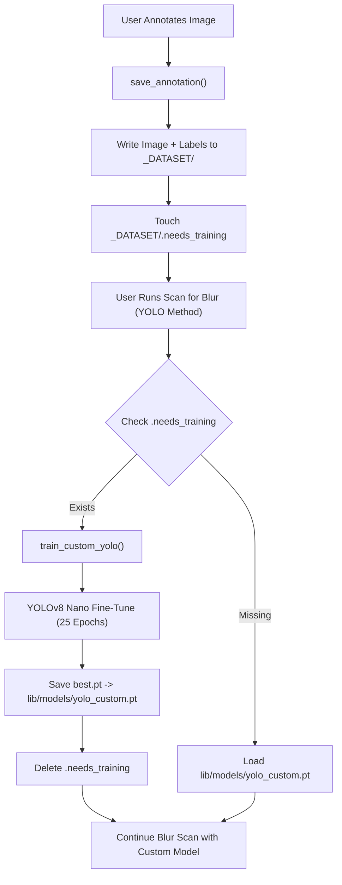

# YOLO Custom Training (Fine-Tuning Pipeline)

This skill documents the end-to-end pipeline for fine-tuning a YOLOv8 Nano model on user-annotated bounding boxes for subject and eye detection in photo culling workflows.



---

## 📂 Dataset Structure

Annotations follow the standard YOLO format under `_DATASET/`:

```
_DATASET/
├── dataset.yaml
├── .needs_training
├── images/
│   └── train/
│       ├── anno_<uuid>_<orig_name>.jpg
│       └── ...
└── labels/
    └── train/
        ├── anno_<uuid>_<orig_name>.txt
        └── ...
```

- **`dataset.yaml`**: Auto-generated YOLO dataset config pointing to `images/train` with two classes: `0: subject`, `1: eye`.
- **Images**: Copied or saved as JPEG (quality 95) from the original photo session.
- **Labels**: Normalized YOLO format (`class x_center y_center width height`) for subject and/or eye bounding boxes.
- **`.needs_training`**: Sentinel file that triggers retraining on the next YOLO-based scan.

---

## ✏️ Annotation Flow

1. User activates **Annotation Mode** and draws bounding boxes around subjects and/or eyes.
2. `save_annotation()` in `culler/dataset_exporter.py` handles:
   - Directory creation (`create_dataset_structure`)
   - UUID-based unique naming to prevent collisions
   - Image format conversion (RGBA/P -> RGB JPEG)
   - Label normalization via `normalize_box()` (pixel coords -> 0-1 normalized)
3. On success, `Path("_DATASET/.needs_training").touch()` is created to signal that the model needs retraining.
4. Box coordinates are also persisted to SQLite (`image_records.detection_box`, `image_records.eye_box`) for immediate UI display.

---

## 🚂 Training Trigger & Execution

Training is triggered automatically when:
- `dataset.yaml` exists
- `.needs_training` sentinel file exists
- User initiates a **Scan for Blur** using any YOLO-based method (`YOLO Subject`, `Bird/Wildlife ROI`, `Eye Detection`, etc.)

### Training Configuration

| Parameter | Value | Rationale |
| :--- | :--- | :--- |
| **Base Model** | `yolov8n.pt` (YOLOv8 Nano) | Fastest inference, ideal for real-time UI scanning |
| **Epochs** | 25 | Balance between fine-tuning time and convergence for small custom datasets |
| **Image Size** | 640px | Standard YOLO training resolution |
| **Device** | GPU (`cuda:0`) if available, else `CPU` | Auto-detected via PyTorch |
| **Workers** | `0` | Prevents Windows multiprocessing freeze |
| **Output** | `runs/culler_custom/weights/best.pt` | Ultralytics default run directory |
| **Final Path** | `lib/models/yolo_custom.pt` | Copied after training for automatic reuse |

### Training Call

```python
# gui.py - _on_scan_blur trigger
if should_train:
    prog_dialog.set_count_label("Epoch")
    photo_count = count_training_images("_DATASET/images/train")
    prog_dialog.set_training_photo_count(photo_count)
    success = train_custom_yolo(
        dataset_dir="_DATASET",
        epochs=25,
        on_progress=on_prog,
        sync=True  # Blocks UI thread with modal dialog
    )
```

---

## 📊 Progress Dialog Behavior

During training, a cancellable `ProgressDialog` modal displays:

1. **Count Label**: Switched from `"Photos"` to `"Epoch"` via `set_count_label("Epoch")`.
2. **Photo Count**: A secondary label shows `"Training on N photos"` via `set_training_photo_count(N)`, counting files in `_DATASET/images/train/`.
3. **Epoch Progress**: `Epoch: 3 / 25 (12%)` with elapsed time and ETA estimation.
4. **Status Messages**: Prefixed with `"Training: "` for all callback updates.

---

## 🔄 Automatic Reuse & Retraining

- **Post-Training**: `.needs_training` is deleted, and the active session's YOLO model cache is invalidated (`image_loader._yolo_model = None`).
- **Subsequent Scans**: The app loads `lib/models/yolo_custom.pt` directly without retraining.
- **New Annotations**: Saving a new annotation recreates `.needs_training`, triggering retraining on the next YOLO scan.

---

## 💻 Code Reference

```python
# culler/dataset_exporter.py - Annotation persistence
def save_annotation(image_path, img_w, img_h, subject_box, eye_box, dataset_dir="_DATASET", pil_image=None):
    images_dir, labels_dir = create_dataset_structure(dataset_dir)
    # Save image + normalized labels
    # Touch _DATASET/.needs_training on success

# culler/ml_trainer.py - Training worker
def train_custom_yolo(dataset_dir="_DATASET", epochs=25, on_progress=None, on_complete=None, on_error=None, sync=False):
    model = YOLO("lib/models/yolov8n.pt")
    model.add_callback("on_train_epoch_end", on_epoch_end)
    results = model.train(data=dataset_yaml, epochs=epochs, imgsz=640, device=device, workers=0, ...)
    shutil.copy2(runs_dir / "culler_custom" / "weights" / "best.pt", "lib/models/yolo_custom.pt")

# gui.py - Progress dialog wiring
prog_dialog.set_count_label("Epoch")
prog_dialog.set_training_photo_count(photo_count)
prog_dialog.update_progress(ep, tot, f"Training: {msg}")
```
