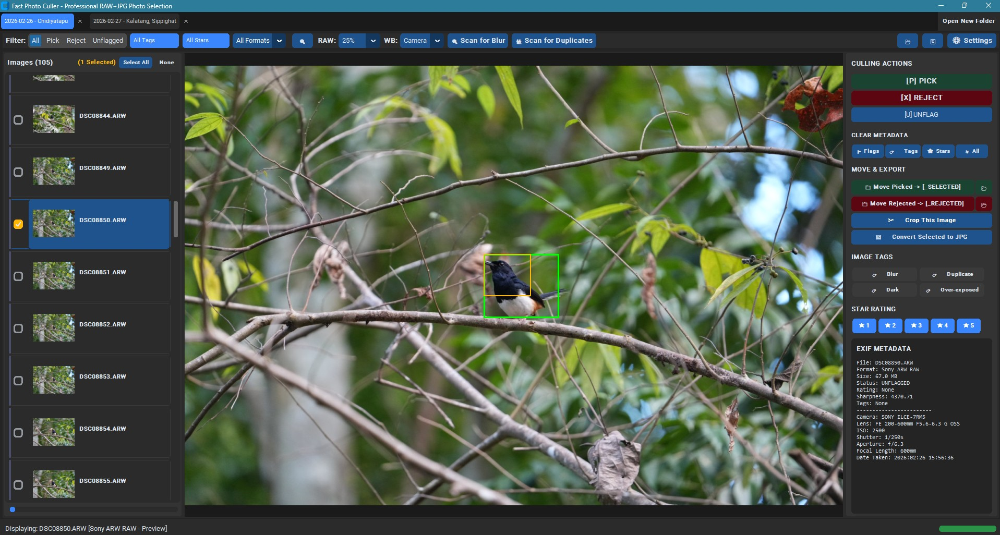

# Python Image Culler

> **Note**: This is an experimental project designed to test and evaluate automated image culling algorithms.

A high-performance Python photo culling application designed for professional photography workflows. Supports **Sony ARW RAW**, **JPG**, **PNG**, and **HEIF/HEIC**.



---

## ⚠️ Disclaimer & Data Safety

> [!WARNING]
> - **Non-Destructive Workflow**: Flagging, tagging, rating, or cropping photos within Python Image Culler does not alter original RAW image data. File organization actions (such as batch moving to `_SELECTED/` or `_REJECTED/` subfolders or moving items to Trash) perform real disk operations.
> - **Backup Recommendation**: Always maintain backup copies of your primary memory cards or photo sessions before executing batch moves or file deletions.
> - **AI & Blur Detection Accuracy**: Automated focus sharpness, eye detection (YOLOv8, DoG), and duplicate scanning (dHash, EXIF) serve as culling acceleration tools. Photographers are advised to perform final manual review on key shots prior to permanent deletion.

---

## 🌟 Key Features

- **Multi-Format & RAW Support**: Ultra-fast Sony ARW preview extraction via embedded ExifTool, JPG, PNG, and HEIF/HEIC.
- **7 Blur Detection Algorithms**: Variance of Laplacian, Tenengrad Sobel, Brenner, FFT Frequency, Local Patch Variance, Bird/Wildlife ROI, and YOLOv8 AI Subject Detection (with Safe Blur Scan mode).
- **3 Duplicate Detection Methods**: Perceptual dHash, MD5 exact file hash, and EXIF Burst Time Window with smart keeper selection (eye sharpness, overall sharpness, rating, file size).
- **Multi-Tab Workspace**: Open multiple photo folders in separate tabs with drag-and-drop reordering, independent filters, SQLite tab state persistence, and lazy loading.
- **Inspector Viewer & Tools**: Inspector pan/zoom, interactive crop tool, EXIF sidebar, multi-select batch operations, and EXIF/XMP rating synchronization.
- **Batch Organization**: One-click move to `_SELECTED/` or `_REJECTED/` subfolders, trash integration, and CSV/JSON manifest export.
- **Custom YOLOv8 Training**: Fine-tune a YOLOv8 Nano model on your own annotated bounding boxes for subject and eye detection. The trained model is saved locally and reused automatically for future scans.

---

## 🧠 How YOLO Training Works

1. **Annotate Images**: Use the built-in annotation tool to draw bounding boxes around subjects and/or eyes in your photos. Each annotation is saved to a local YOLO-format dataset under `_DATASET/`.
2. **Trigger Training**: When you run **Scan for Blur** using any YOLO-based method (e.g., `YOLO Subject`, `Bird/Wildlife ROI`, `Eye Detection`), the app checks for a `.needs_training` marker. If found, it fine-tunes YOLOv8 Nano on your custom dataset for 25 epochs using the CPU or GPU.
3. **Progress Tracking**: A modal dialog shows epoch progress and the total number of training photos. Once complete, the best weights are saved to `lib/models/yolo_custom.pt`.
4. **Automatic Reuse**: On subsequent scans, the custom model is loaded automatically. If you add new annotations, delete `.needs_training` to retrain, or simply annotate more images—the next blur scan will trigger retraining.

> [!TIP]
> - You can manually trigger retraining by deleting the `.needs_training` file in `_DATASET/`.
> - Training runs synchronously on the UI thread with a cancellable progress dialog. It uses `workers=0` to avoid Windows multiprocessing issues.

---

## 🚀 Quick Start

```bash
pip install -r requirements.txt

# Launch GUI (blank or restores open tabs)
python gui.py

# Launch GUI and open a specific folder
python gui.py "D:\Photos\2024"

# Launch GUI, open containing folder, and automatically select the specified image
python gui.py "D:\Photos\2024\DSC01234.ARW"

# CLI Commands (accept directory or specific image file)
python culler.py scan "D:\Photos\2024"
python culler.py cull "D:\Photos\2024\DSC01234.JPG"
```

---

## ⌨️ Keyboard Shortcuts

| Key | Action |
|---|---|
| `P` / `X` / `U` | Flag as **PICK** / **REJECT** / **UNFLAGGED** |
| `1` – `5` | Set Star Rating (1 to 5 Stars) |
| `C` / `Ctrl+S` / `Esc` | Enter Manual Crop / Save Crop / Cancel Crop |
| `Ctrl+C` | Copy active image (or cropped selection) to Clipboard |
| `Left` / `Right` / `Up` / `Down` | Navigate `+/- 1` Photo |
| `Ctrl` + Arrow | Jump `+/- 10` Photos |
| `Shift` + Arrow / `Ctrl` + Click | Multi-Select Range / Random Multi-Select |
| `Delete` / `D` | Move selected photos to Trash / Recycle Bin |
| `Home` / `End` / `PgUp` / `PgDn` | Jump to First / Last / +/- 10 Photos |
| `Mouse Wheel` / `Drag` / `Double Click` | Zoom / Pan / Reset View |

---

## 🧪 Unit Tests

```bash
pytest
```

